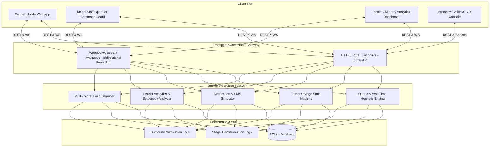

# AnnaSetu (अन्नसेतु) Technical Architecture

## 1. System Architecture Overview

---

## 2. Queue Wait-Time Estimation Formulation

Given:
- $N_{ahead}$: Number of vehicles ahead in queue for the center.
- $W_{active}$: Number of active weighbridge lanes at the center.
- $L_{active}$: Number of active quality testing labs at the center.
- $T_{weigh}^{base}$: Base weigh time for the selected crop (minutes).
- $F_{vehicle}$: Vehicle impact multiplier (e.g. 1.0 for standard tractor, 1.6 for 2-trolley tractor, 2.2 for commercial truck).
- $T_{quality}^{base}$: Base quality inspection and moisture test duration (minutes).
- $B_{transit}$: Buffer time for vehicle maneuvering and repositioning ($\approx 3$ minutes).

The effective service rate per vehicle $\mu$ is constrained by the bottleneck stage:
$$\mu_{stage} = \max\left(\frac{T_{weigh}^{base} \times F_{vehicle}}{W_{active}}, \frac{T_{quality}^{base}}{L_{active}}\right)$$

The dynamic estimated wait time $T_{wait}$ is computed as:
$$T_{wait} = \lceil N_{ahead} \times (\mu_{stage} + B_{transit}) \rceil \text{ minutes}$$

---

## 3. Mandi Load-Balancing Optimization Formula

For a farmer located at coordinate $(Lat_f, Lon_f)$, candidate procurement centers $C_i$ are evaluated on total time investment:

$$T_{total}(C_i) = T_{travel}(C_i) + T_{wait}(C_i)$$

Where:
$$T_{travel}(C_i) = \frac{\text{HaversineDistance}((Lat_f, Lon_f), (Lat_{C_i}, Lon_{C_i}))}{V_{avg\_tractor}} \times 60$$

The center $C^*$ with $\min_{i} T_{total}(C_i)$ is recommended to the farmer, preventing localized traffic concentration and distributing harvest flow across the district.
